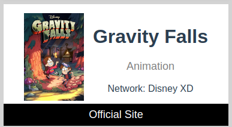

## Consigna

Utilizando el servicio Shows de usos multiples en esta aplicación, se presentan a continuación, cinco puntos a resolver mediante la modificación o adición de archivos en las carpetas correspondientes. Se requiere el uso de Vue 2 y JavaScript para completar los siguientes desafíos:

# Puntos a resolver

1. Ajustar la respuesta para que cada uno de los elementos del listado coincida con el siguiente esquema y luego utilizar dicho listado en el template de Vue:
```javascript
   {
      "image": "", // image.original
      "name": "", // name
      "type": "" // type
      "network": "" // network.name
      "officialSite": "" // officialSite
      "genres": [] // genres
   }
```
> **_NOTA:_** Si lo considera necesario puede agregar más campos a la respuesta.

2. Ordenar el listado en forma ascendente, según la cantidad de vocales que tiene el nombre del show. En caso de coincidir en la cantidad, utilizar orden alfabético.
```
Ej:
id:1; "MURCIELAGO";
id:2; "HOLA";
id:3; "PEPE";
id:4; "CHAU";
id:5; "FERROCARRIL";

ORDENADO:
id:4; "CHAU"; VOCALES: 2
id:3; "PEPE"; VOCALES: 2
id:2; "HOLA"; VOCALES: 2
id:5; "HOLA"; VOCALES: 4
id:1; "MURCIELAGO"; VOCALES: 5
```

3. Desarrolle un componente, que liste todos los géneros existentes y permita la selección de 1 o más géneros. 

4. Utilizando el componente desarrollado en el paso anterior, filtre solos aquellos shows que pertenezcan a los géneros seleccionados. Tener en cuenta que en el futuro se desea filtrar por otros campos.

5. Ajustar el estilo para que la card se vea según esta imagen

   


# Requerimientos

- Vue.js 2.6
- JavaScript
